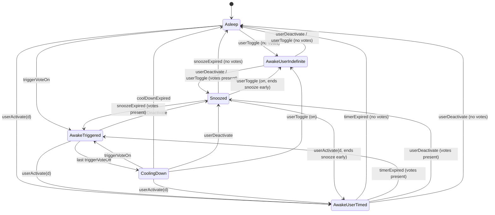

# 03 — State Machine

| Field | Value |
|---|---|
| **Document version** | 0.1 |
| **Status** | Draft (awaiting review) |
| **Resolves Open Questions** | OQ-01 (multi-trigger priority), OQ-02 (manual vs trigger conflict) |
| **Depends on** | 01-PRD.md, 02-architecture.md (esp. §4.1 `AwakeManager`, §4.4 `Trigger`, §4.5 `TriggerCoordinator`) |
| **Last updated** | 2026-04-25 |

---

## 1. Purpose & scope

This doc specifies **how `AwakeManager` decides whether the Mac should be awake** at any moment, given:

- explicit user actions (toggle, preset durations, deactivate),
- N independent triggers each casting "want awake" / "don't want awake" votes,
- timer expirations.

The state machine is the single source of truth for awake/asleep behaviour. All other components (UI, AppIntents, triggers) only feed inputs into this machine; they never decide state on their own.

This doc does **not** cover:
- Persistence of state across launches (see 04-data-model.md). The state machine resets to `Asleep` on every cold launch — by design; the user's Mac should never wake on relaunch unless they explicitly enable "Activate on launch".
- Per-trigger watching/permission logic (each `Trigger` impl handles that internally).
- UI rendering of state (the UI just reads `AwakeManager`'s `@Published` properties).

---

## 2. Design principles

These principles guide every transition decision below. When in doubt during implementation, fall back to these.

1. **The user is always right.** Any explicit user action overrides any trigger vote — but only **for a bounded time** so the user doesn't get stuck in a "why didn't auto-on work?" state forever.
2. **No flapping.** When triggers stop voting, we wait briefly before deactivating. A 30-second gap between two back-to-back Zoom calls should not visibly toggle the Mac.
3. **Crash-safe defaults.** If we ever can't decide what state we should be in, prefer **Asleep** (releases the assertion). Battery and overnight drain are worse failure modes than "Mac slept during a call I forgot to put on the calendar".
4. **Explicit reasons.** Every non-Asleep state carries an `AwakeReason` so the UI can tell the user *why* their Mac is awake. No silent activations.
5. **One actor, one state.** All transitions happen on `@MainActor`. Inputs from background tasks (e.g., calendar polling) hop to the main actor before applying.

---

## 3. State definitions

The machine has **6 states**. State carries data (timers, reasons); transitions are deterministic given (current state, input).

| State | Power assertion held? | Display awake? | UI label |
|---|---|---|---|
| `Asleep` | No | No | "Off" |
| `AwakeUserIndefinite` | Yes | per `allowDisplaySleep` | "On — until you turn off" |
| `AwakeUserTimed(endsAt)` | Yes | per `allowDisplaySleep` | "On — until {endsAt}" |
| `AwakeTriggered(votes)` | Yes | per `allowDisplaySleep` | "On — {topVote.reason}" |
| `CoolingDown(until)` | Yes | per `allowDisplaySleep` | "Cooling down — {until}" (hidden detail in UI; surfaces as "On" still) |
| `Snoozed(until)` | No | No | "Off — auto-on paused for {remaining}" |

### 3.1 State data

```swift
enum AwakeState: Equatable {
    case asleep
    case awakeUserIndefinite
    case awakeUserTimed(endsAt: Date)
    case awakeTriggered(votes: [String: TriggerVote])  // keyed by trigger.id
    case coolingDown(until: Date, lastVotes: [String: TriggerVote])
    case snoozed(until: Date)
}
```

### 3.2 State invariants

These hold at all times; an implementation bug if violated.

- `Asleep` and `Snoozed` are the only states where the power assertion is **released**.
- `AwakeUserTimed.endsAt` is always in the future when entered.
- `AwakeTriggered.votes` is non-empty (≥1 vote with `wantsAwake == true`).
- `CoolingDown.until` is exactly `lastVoteOffAt + 60s`.
- `Snoozed.until` is exactly `userDeactivatedAt + 5min`.
- Only one of these states can be active. There is no concurrent overlay of "user state" and "trigger state".

### 3.3 Power assertion mode

Independent of which awake state is active, the assertion mode is determined by `SettingsStore.allowDisplaySleep`:

- `false` (default) → `kIOPMAssertionTypeNoDisplaySleep`
- `true` → `kIOPMAssertionTypeNoIdleSleep`

This is set on the `PowerAssertion` *at the moment it activates*. Toggling `allowDisplaySleep` while awake re-acquires the assertion with the new mode.

---

## 4. Inputs

The machine reacts to a closed set of inputs. Anything outside this list is undefined and should be added explicitly (don't sneak new inputs into `AwakeManager`).

| Input | Source | Payload |
|---|---|---|
| `userToggle` | UI button, AppIntents `Toggle` | none |
| `userActivate(duration)` | UI duration picker, AppIntents `Start(minutes:)` | `AwakeDuration` |
| `userDeactivate` | UI "Off" button, AppIntents `Stop` | none |
| `triggerVoteOn(id, vote)` | `TriggerCoordinator` | `TriggerVote` (wantsAwake = true) |
| `triggerVoteOff(id)` | `TriggerCoordinator` | trigger id |
| `timerExpired` | internal `AwakeManager` timer | none |
| `coolDownExpired` | internal timer | none |
| `snoozeExpired` | internal timer | none |
| `allowDisplaySleepChanged` | settings UI | new `Bool` value |

`userToggle` is desugared at the boundary into `userActivate(.indefinite)` if currently off, or `userDeactivate` if currently on. The inner state machine never sees `userToggle` directly.

---

## 5. Resolved Open Questions

### 5.1 OQ-01 — Multi-trigger aggregation

**Question**: When trigger A and trigger B both vote `wantsAwake = true`, who wins?

**Decision**: **any-OR aggregation.** If *any* trigger votes ON, the aggregate is ON. The Mac stays awake.

**Rationale**:
- Triggers exist precisely because users want different rules to all keep the Mac awake. Conflict between "Calendar says yes" and "Wi-Fi says no" never actually happens — neither trigger asks the Mac to sleep; they each ask it to stay awake.
- Any AND-style or priority-ordered policy would surprise users. ("Why didn't my calendar trigger fire? Oh, because Wi-Fi was off.")
- The aggregation is a pure function of `votes.values.contains(where: { $0.wantsAwake })`.

**UI consequence**: When multiple triggers vote ON, the UI displays the **most recently changed** vote's `reason` ("Awake during Zoom call" rather than "Awake on home Wi-Fi"). This is a presentation choice; aggregation logic is unaffected.

**Code**:
```swift
extension AwakeState {
    static func aggregate(_ votes: [String: TriggerVote]) -> Bool {
        votes.values.contains { $0.wantsAwake }
    }
}
```

### 5.2 OQ-01 (cont.) — Cool-down period

**Question**: When the last trigger drops its vote, do we deactivate immediately?

**Decision**: **No. Wait 60 seconds** in `CoolingDown`. If any trigger re-votes ON within that window, return to `AwakeTriggered` without ever releasing the assertion. Only after 60 s of zero votes do we transition to `Asleep`.

**Rationale**:
- A 30-second gap between back-to-back Zoom calls is common ("call ends 14:30, next starts 14:31"). Without cool-down the Mac would sleep for ~60 s and wake up flapping the display, which is jarring on a MacBook lid-up.
- Calendar trigger fires `voteOff` at the *exact end time* of an event; if the next event starts in 1 minute the user shouldn't see any visible state change.
- 60 s is long enough to absorb back-to-back events, short enough that battery isn't meaningfully affected.

**Configurable?** Not in v1. The constant `CoolDownDuration = 60` lives in `Sources/Core/AwakeManager.swift`. If a user complains in TestFlight that 60 s is wrong, we revisit before launch.

### 5.3 OQ-02 — Manual interaction with active triggers

**Three cases**, each resolved independently:

#### 5.3.1 Manual ON while a trigger is already voting ON

**Decision**: **No-op for state transitions.** The aggregate was already ON; we stay in `AwakeTriggered`. The user feels nothing weird ("clicking it is a no-op since it's already on") and we don't downgrade trigger state into user state.

**Why not transition to `AwakeUserIndefinite`?** Because if the user later turns it off, we want the trigger to resume control if it's still voting. Promoting trigger state into user state would lose that information.

**UI consequence**: The toggle is already showing "On"; clicking ON again is visually a no-op. (In practice, the UI hides the explicit "On" button when state is awake — only "Off" is shown — so this case rarely arises.)

#### 5.3.2 Manual OFF while a trigger is voting ON

**Decision**: **Enter `Snoozed(until: now + 5min)`.** The assertion is released. Trigger votes are recorded but **ignored** for 5 minutes. After 5 minutes, the snooze ends and the machine re-evaluates: if any trigger is still voting ON, transition to `AwakeTriggered`; else `Asleep`.

**Rationale**:
- Without snooze, the user clicks OFF, the trigger immediately re-votes ON, and the Mac stays awake. The user concludes the app is broken.
- Without an upper bound, the user clicks OFF intending to snooze "for the next 5 minutes during this important quiet moment" but later forgets to re-enable, and the Mac drains overnight.
- 5 minutes is the floor of "long enough to be useful, short enough to be safe." Tested mental model: "I can give myself 5 minutes of guaranteed sleep, then it goes back to auto."

**Snooze is per-machine, not per-trigger.** Snooze suppresses **all** triggers for 5 minutes. We considered per-trigger snooze and rejected it as too granular for v1; if testers ask, revisit at Phase 1.5.

**UI consequence**: Menu bar shows "Off — auto-on paused for 4:32" with countdown. Clicking ON during snooze ends the snooze immediately and enters `AwakeUserIndefinite`.

#### 5.3.3 Manual ON when no trigger is voting

**Decision**: **Enter `AwakeUserIndefinite`** (matches today's plain Caffeinated-style toggle). User stays awake until they manually turn off or pick a duration.

**Configurable?** The constant `SnoozeDuration = 5*60` lives in `Sources/Core/AwakeManager.swift`. Not user-tweakable in v1.

---

## 6. State diagram



> **Reading the diagram**: a transition labelled `X (cond)` fires on input X only when condition `cond` holds. Conditions reference whether any trigger is currently voting ON ("votes present" / "no votes"). When a state has multiple outgoing edges for the same input, the conditions partition the cases.

---

## 7. Transition table

This is the **canonical** transition spec. Implementation must match this table exactly. Any cell marked **invariant** is unreachable by construction; if reached, log `.fault` and reset to `Asleep`.

| ↓ State \ Input → | `userActivate(d)` | `userDeactivate` | `userToggle` | `triggerVoteOn(id, v)` | `triggerVoteOff(id)` | `timerExpired` | `coolDownExpired` | `snoozeExpired` |
|---|---|---|---|---|---|---|---|---|
| `Asleep` | → `AwakeUserTimed(now+d)` | no-op | → `AwakeUserIndefinite` (no votes recorded — none can exist here) | → `AwakeTriggered({id:v})` | no-op (vote was already off) | invariant | invariant | invariant |
| `AwakeUserIndefinite` | → `AwakeUserTimed(now+d)` | branch: votes present → `Snoozed(now+5m)`; else → `Asleep` | desugared to `userDeactivate` | record vote in shadow set; state unchanged | drop vote from shadow set; state unchanged | invariant | invariant | invariant |
| `AwakeUserTimed(endsAt)` | → `AwakeUserTimed(now+d)` (replace timer) | branch: votes present → `Snoozed(now+5m)`; else → `Asleep` | desugared to `userDeactivate` | record vote in shadow set; state unchanged | drop vote from shadow set; state unchanged | branch: votes present → `AwakeTriggered(shadowVotes)`; else → `Asleep` | invariant | invariant |
| `AwakeTriggered(votes)` | → `AwakeUserTimed(now+d)` (votes preserved in shadow set) | → `Snoozed(now+5m)` | desugared to `userDeactivate` | merge: `votes[id] = v`; stay in `AwakeTriggered` | remove `votes[id]`; if empty → `CoolingDown(now+60s, lastVotes: votes)`; else stay | invariant | invariant | invariant |
| `CoolingDown(until, lastVotes)` | → `AwakeUserTimed(now+d)` | → `Snoozed(now+5m)` | branch: input is "on" → `AwakeUserIndefinite` (cancels cool-down timer); input is "off" desugared to `userDeactivate` | → `AwakeTriggered({id:v})` (cancels cool-down timer) | no-op (already removed) | invariant | → `Asleep` | invariant |
| `Snoozed(until)` | → `AwakeUserTimed(now+d)` (cancels snooze timer) | no-op (already off) | branch: input is "on" → `AwakeUserIndefinite` (cancels snooze); input is "off" no-op | record vote in shadow set; state unchanged (snooze suppresses) | drop vote from shadow set; state unchanged | invariant | invariant | branch: shadow set has any wantsAwake=true → `AwakeTriggered(shadowVotes)`; else → `Asleep` |

### 7.1 Notes on the table

- **"Shadow set"**: `AwakeUserIndefinite`, `AwakeUserTimed`, `Snoozed` track trigger votes silently in a side dict (`pendingVotes: [String: TriggerVote]`). They don't act on votes, but they don't *forget* either. When the user state ends (timer expiry, snooze expiry, manual deactivate), the shadow set is consulted to decide the next state.
- **`AwakeUserTimed → AwakeUserTimed` on `userActivate(d)`**: replaces the timer. This handles "I picked 30m, then changed my mind to 1h." Idempotent if `d` is the same.
- **`userDeactivate` from `Snoozed`**: no-op. Mac is already not held awake; user clicking off again is a no-op. UI should hide the off button in this state.
- **`coolDownExpired` while `AwakeTriggered`**: invariant violation. The cool-down timer is only set when entering `CoolingDown` and cancelled when leaving it. If we receive `coolDownExpired` in any other state, that's a stale-timer bug — log fault, ignore.
- **Identical reasoning for `snoozeExpired` outside `Snoozed`** and `timerExpired` outside `AwakeUserTimed`.

### 7.2 Side effects per transition

Beyond moving between states, these side effects fire on entry/exit:

| Entering state | Side effect |
|---|---|
| `AwakeUserIndefinite`, `AwakeUserTimed`, `AwakeTriggered`, `CoolingDown` | If assertion not held, acquire it (mode = current `allowDisplaySleep`). |
| `Asleep`, `Snoozed` | Release assertion. |
| `AwakeUserTimed(endsAt)` | Schedule `timerExpired` for `endsAt`. |
| `CoolingDown(until)` | Schedule `coolDownExpired` for `until`. |
| `Snoozed(until)` | Schedule `snoozeExpired` for `until`. |

| Leaving state | Side effect |
|---|---|
| `AwakeUserTimed` | Cancel pending `timerExpired`. |
| `CoolingDown` | Cancel pending `coolDownExpired`. |
| `Snoozed` | Cancel pending `snoozeExpired`. |

Side effects are idempotent: re-entering the same state with new data (e.g., `AwakeUserTimed(newEndsAt)`) cancels the old timer and schedules a new one.

---

## 8. Worked examples

These traces show the machine in action. Each step lists `(state before) + input → (state after)`. Used as test fixtures in session 7.

### 8.1 Happy path: Zoom meeting

```
14:00  Asleep                      + cal.voteOn(meetingA)    → AwakeTriggered({cal: A})
14:30  AwakeTriggered({cal: A})    + cal.voteOff(meetingA)   → CoolingDown(until=14:31, lastVotes={cal: A})
14:31  CoolingDown(until=14:31)    + coolDownExpired         → Asleep
```

User experiences: Mac awake during 14:00–14:31, sleeps after. No flapping.

### 8.2 Back-to-back meetings (cool-down absorbs gap)

```
14:00  Asleep                      + cal.voteOn(A)           → AwakeTriggered({cal: A})
14:30  AwakeTriggered              + cal.voteOff(A)          → CoolingDown(until=14:31)
14:30:30  CoolingDown              + cal.voteOn(B)           → AwakeTriggered({cal: B})  // assertion never released
15:00  AwakeTriggered              + cal.voteOff(B)          → CoolingDown(until=15:01)
15:01  CoolingDown                 + coolDownExpired         → Asleep
```

User experiences: Mac awake continuously 14:00–15:01.

### 8.3 User snoozes during a call

```
14:00  Asleep                      + cal.voteOn(A)           → AwakeTriggered({cal: A})
14:05  AwakeTriggered              + userDeactivate          → Snoozed(until=14:10)
14:07  Snoozed                     + cal.voteOn(B)           → Snoozed (shadow set: {cal: A, B})
14:10  Snoozed                     + snoozeExpired           → AwakeTriggered({cal: A, B})
```

User experiences: 5-minute guaranteed off; then auto-on resumes (because cal events are still active).

### 8.4 User activates manually, trigger fires later

```
14:00  Asleep                      + userActivate(.minutes(30)) → AwakeUserTimed(endsAt=14:30)
14:15  AwakeUserTimed              + cal.voteOn(A)           → AwakeUserTimed (shadow set: {cal: A})
14:30  AwakeUserTimed              + timerExpired            → AwakeTriggered({cal: A})  // shadow set promoted
14:50  AwakeTriggered              + cal.voteOff(A)          → CoolingDown(until=14:51)
14:51  CoolingDown                 + coolDownExpired         → Asleep
```

User experiences: 14:00–14:51 awake. Their 30-min timer expired but a calendar event was already in progress; the Mac correctly stays awake until the call ends + cool-down.

### 8.5 User force-off during cool-down

```
14:00  Asleep                      + cal.voteOn(A)           → AwakeTriggered({cal: A})
14:30  AwakeTriggered              + cal.voteOff(A)          → CoolingDown(until=14:31)
14:30:15  CoolingDown              + userDeactivate          → Snoozed(until=14:35:15)
14:30:20  Snoozed                  + cal.voteOn(B)           → Snoozed (shadow updated)
14:35:15  Snoozed                  + snoozeExpired           → AwakeTriggered({cal: B})
```

User experiences: User actively wanted off → they get exactly 5 minutes of guaranteed off, even if a new calendar event starts during the snooze.

### 8.6 Crash recovery (cold launch)

```
[crash; signal handler released assertion]
[user reopens app]
boot  → Asleep                   (always — no persisted awake state)
```

User experiences: app reopens in `Asleep`. They re-toggle if they want awake. **By design**: never silently re-acquire assertion on launch (would surprise users who closed the app to release it).

---

## 9. Concurrency notes

All state transitions execute on `@MainActor`. Inputs from background tasks (e.g., calendar polling on a `Task.detached`) are dispatched to the main actor before being passed to `AwakeManager.receive(_:)`.

Pseudocode for `AwakeManager.receiveTriggerVote`:

```swift
@MainActor
func receiveTriggerVote(_ vote: TriggerVote, from triggerId: String) {
    if vote.wantsAwake {
        process(input: .triggerVoteOn(id: triggerId, vote: vote))
    } else {
        process(input: .triggerVoteOff(id: triggerId))
    }
}
```

`process(input:)` is the FSM step function: pure given `(currentState, input, currentVotes)`, deterministic, no I/O. Side effects (assertion, timers) are dispatched after the new state is computed.

This separation lets us unit-test `process(input:)` exhaustively without touching IOKit or scheduling.

---

## 10. Test plan (for sessions 6–7)

The state machine gets the highest coverage of any module — it's pure logic and the heart of the app.

### 10.1 Unit tests (must)

- One test per cell of the transition table in §7. Every (state × input) combination is asserted.
- All worked examples in §8 are encoded as integration-style tests on a faked clock.
- Invariants in §3.2 are checked after every transition in a property-style test (random input sequences).
- Side effects (assertion acquire/release, timer schedule/cancel) are asserted via `MockPowerAssertion` and an injected fake scheduler.

### 10.2 Integration tests (must)

- End-to-end: register a `MockTrigger`, drive votes, observe `AwakeManager.isAwake` transitions.
- Snooze + concurrent trigger votes preserve the shadow set correctly.
- Crash mid-cool-down releases the assertion via `signal()` handler.

### 10.3 Property checks (nice-to-have, session 7)

For random input sequences of length 20:
- Final state is reachable from `Asleep`.
- Assertion held iff state ∈ {`AwakeUserIndefinite`, `AwakeUserTimed`, `AwakeTriggered`, `CoolingDown`}.
- No timer leaks (every scheduled timer either fires or is cancelled).

---

## 11. Open Questions resolved by this doc

| ID | Status |
|---|---|
| OQ-01 | **Resolved**: any-OR aggregation; 60 s cool-down before `Asleep`. |
| OQ-02 | **Resolved**: user-OFF during trigger-ON → 5 min `Snoozed`; user-ON during trigger-ON → no-op; user-ON with no votes → indefinite. |

Remaining open questions stay deferred per their original target docs (see 01-PRD.md §11).

---

## 12. Decisions Log (this doc)

| Date | Decision |
|---|---|
| 2026-04-25 | 6 states: `Asleep`, `AwakeUserIndefinite`, `AwakeUserTimed`, `AwakeTriggered`, `CoolingDown`, `Snoozed` |
| 2026-04-25 | any-OR vote aggregation across triggers |
| 2026-04-25 | `CoolDownDuration = 60s`, `SnoozeDuration = 5min`, both as code constants (not user-tweakable in v1) |
| 2026-04-25 | Cold launch always boots into `Asleep`; awake state is not persisted |
| 2026-04-25 | "Shadow set" pattern: user-state retains trigger votes silently for promotion on user-state exit |
| 2026-04-25 | Manual ON is no-op when already awake (does not promote trigger state into user state) |
| 2026-04-25 | Snooze is global (suppresses all triggers); per-trigger snooze deferred to Phase 1.5 |

---

## 13. Document Change Log

| Version | Date | Changes |
|---|---|---|
| 0.1 | 2026-04-25 | Initial draft (session 2) |

---

## 14. Sign-off Checklist (before moving to 04-data-model.md)

- [x] Owner accepts the 6-state model (§3)
- [x] Owner accepts any-OR aggregation + 60 s cool-down (§5.1, 5.2)
- [x] Owner accepts the 5-minute snooze for manual-OFF-during-trigger (§5.3.2)
- [x] Owner accepts cold-launch-always-`Asleep` policy (§3, §8.6)
- [x] Owner agrees the transition table in §7 is complete and unambiguous
